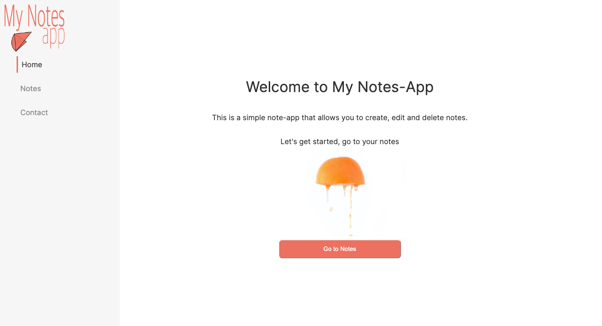
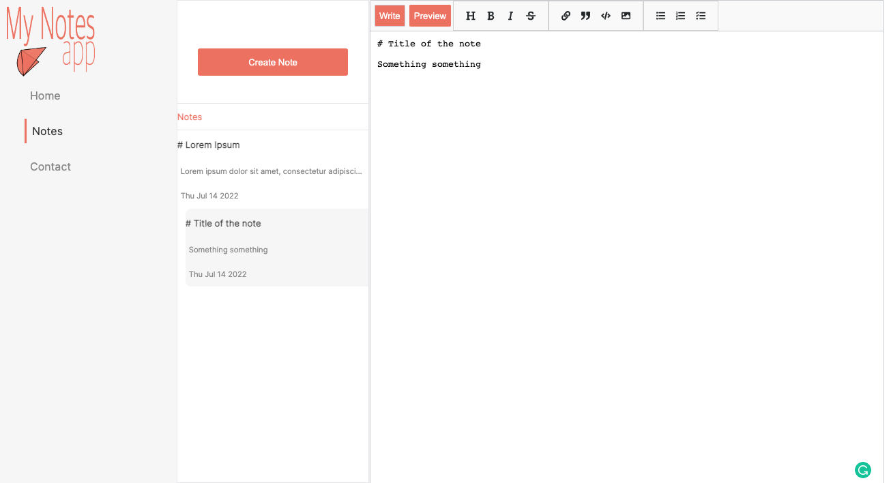

# Getting Started with Create React App

This project was bootstrapped with [Create React App](https://github.com/facebook/create-react-app).

## Note-App

This project is a note app with local storage of the notes. 
It uses react-mde for the editor and react-router for the multiple pages.

## Home Page

  

## Notes Page

  

## Contact Page

  

